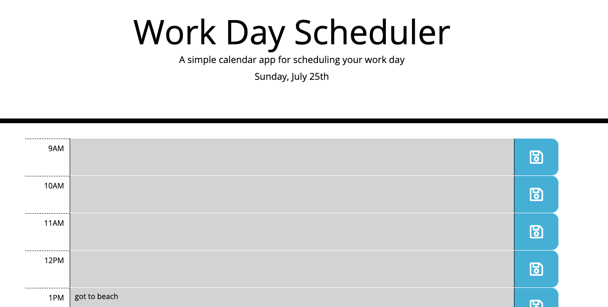
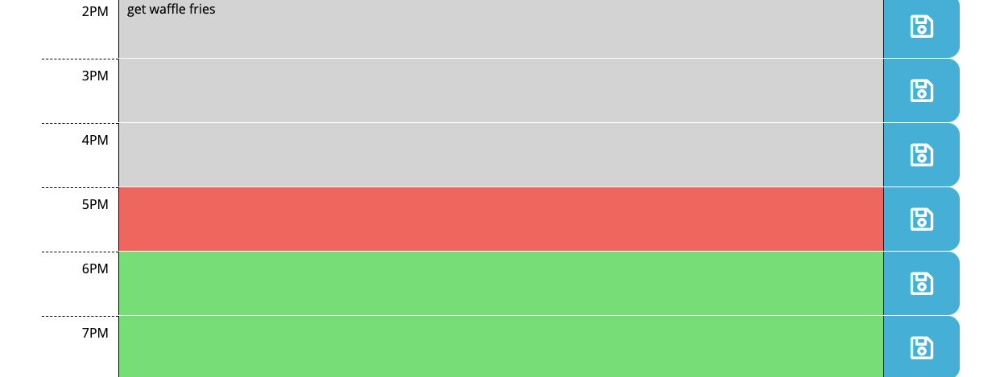

# Work Day Scheduler, Third Party API's - Homework 5, UW Coding Bootcamp

## Description

For the fifth week of the UW Coding Bootcamp my homework invited me to create a simple calendar application that allows a user to save events for each hour of the day by modifying starter code. This app runs in the browser and features dynamically updated HTML and CSS powered by jQuery. It has a clean, polished, and responsive user interface and includes the time of the day, the current day in the header, a space to enter your task for each hour of the day, and a save button to click to save your task using local storage. Each hour is also color coded which updates based on if the time is past/current/future.

## Built With

* [Moment JS](https://momentjs.com/)
* [Font Awesome](https://kit.fontawesome.com/)

## Deployed Link

* [See Live Site](https://spencee1315.github.io/hw_wk5/)

## Preview of Working Site




## Code Snippet
This a code snippet using jquery...........

```javascript
 // Building time slots
    var container = $('.container')
    for (let hr = workDay.start; hr < workDay.end; hr++) {
        let time = moment(hr, 'H')
        let frame = hour > hr ? 'past' : hour < hr ? 'future' : 'present'
        var eventText = values[dateKey][hr] || ''
        let row = $(`
        <div id='time-slot-${hr}' class='time-block row'>
            <span class='hour time-column col-1'>
                <span class='hour-display'>${time.format('hA')}</span>
            </span>
            <span class='info-column col ${frame}'>
                <textarea id='event-input-${hr}' data-hr=${hr} type="text" class='event-input'>${eventText}</textarea>
            </span>
            <span id='save-button-${hr}' data-hr=${hr} class='saveBtn col-1'>
            </span>
        </div>`)
        container.append(row)
    }
```


### Authors

* **Elliott Spencer**

### Contact Information

* [Link to Portfolio Site](https://spencee1315.github.io/hw_wk2/)

* [Link to Github](https://github.com/spencee1315)

* [Link to LinkedIn](https://www.linkedin.com/in/elliott-spencer-886a9818/)

- - -
MIT License

Copyright (c) [2021] [Elliott Spencer]

Permission is hereby granted, free of charge, to any person obtaining a copy
of this software and associated documentation files (the "Software"), to deal
in the Software without restriction, including without limitation the rights
to use, copy, modify, merge, publish, distribute, sublicense, and/or sell
copies of the Software, and to permit persons to whom the Software is
furnished to do so, subject to the following conditions:

The above copyright notice and this permission notice shall be included in all
copies or substantial portions of the Software.

THE SOFTWARE IS PROVIDED "AS IS", WITHOUT WARRANTY OF ANY KIND, EXPRESS OR
IMPLIED, INCLUDING BUT NOT LIMITED TO THE WARRANTIES OF MERCHANTABILITY,
FITNESS FOR A PARTICULAR PURPOSE AND NONINFRINGEMENT. IN NO EVENT SHALL THE
AUTHORS OR COPYRIGHT HOLDERS BE LIABLE FOR ANY CLAIM, DAMAGES OR OTHER
LIABILITY, WHETHER IN AN ACTION OF CONTRACT, TORT OR OTHERWISE, ARISING FROM,
OUT OF OR IN CONNECTION WITH THE SOFTWARE OR THE USE OR OTHER DEALINGS IN THE
SOFTWARE.
